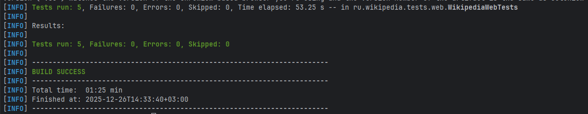
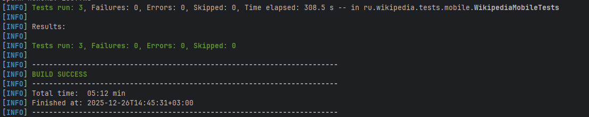

# Auto-testing project

## Описание проекта

Данный репозиторий содержит набор автоматизированных тестов для проверки ключевых пользовательских сценариев в **Wikipedia** в двух средах: веб-версии сайта ru.wikipedia.org и мобильного приложения Wikipedia для Android.

Цель проекта — продемонстрировать пример инфраструктуры автотестов на Java с использованием Selenium и Appium, а также показать, как единый стек инструментов может применяться для разных платформ.

В составе проекта реализованы:
- Автотесты для веб-сайта ru.wikipedia.org (5 тестов), покрывающие базовые сценарии поиска и навигации.
- Автотесты для мобильного приложения Wikipedia (3 теста), проверяющие работу приложения на Android-эмуляторе.

## Архитектура проекта

Проект следует паттерну Page Object Model (POM) для обеспечения чистоты кода и удобства сопровождения. Архитектура включает следующие компоненты:

### Структура проекта
```
src/
├── main/
│   └── java/
│       └── ru/wikipedia/
│           ├── pages/
│           │   ├── web/
│           │   │   └── WikipediaMainPage.java
│           │   └── mobile/
│           │       └── WikipediaMobileMainPage.java
│           └── utils/
│               └── DriverFactory.java
└── test/
    └── java/
        └── ru/wikipedia/
            └── tests/
                ├── web/
                │   └── WikipediaWebTests.java
                └── mobile/
                    └── WikipediaMobileTests.java
```

### Компоненты архитектуры

1. **Page Object Model (POM)**:
   - `WikipediaMainPage` — для веб-версии сайта
   - `WikipediaMobileMainPage` — для мобильного приложения
   - Каждый класс страницы инкапсулирует элементы интерфейса и методы взаимодействия с ними

2. **Driver Factory**:
   - `DriverFactory` — фабрика для создания экземпляров WebDriver для веба и AndroidDriver для мобильного приложения
   - Обеспечивает централизованное управление конфигурацией драйверов

3. **Тестовые классы**:
   - `WikipediaWebTests` — набор тестов для веб-версии
   - `WikipediaMobileTests` — набор тестов для мобильного приложения
   - Используют TestNG для организации и запуска тестов

## Описание тестов

### Веб-тесты (WikipediaWebTests)

1. **testLogoReturnsToMainPage** — Проверяет, что клик по логотипу возвращает на главную страницу
2. **testLanguagesCountIsNumericAndPositive** — Проверяет корректность отображения количества языков
3. **testSearchRedirectsToArticle** — Проверяет, что поиск перенаправляет на статью
4. **testRandomPageAlwaysLeadsToArticle** — Проверяет, что случайная страница всегда ведет на статью
5. **testSearchInputRemainsFunctionalAfterRandomNavigation** — Проверяет работоспособность поля поиска после навигации

### Мобильные тесты (WikipediaMobileTests)

1. **testMultilingualSearch** — Проверяет многоязычный поиск с различными запросами
2. **testSearchChain** — Проверяет цепочку поисковых запросов
3. **testPerformanceSearch** — Проверяет производительность поиска

## Технологический стек

Проект построен на стандартном стеке для UI-автоматизации на Java.
Используемые технологии:

- **Java** 11 — основной язык реализации тестов.
- Selenium WebDriver — для автоматизации взаимодействия с веб-браузером и тестирования ru.wikipedia.org.
- Appium — для автоматизации мобильного приложения Wikipedia на Android.
- TestNG — фреймворк для организации тестов, группировок и отчетов.
- Maven — система сборки и управления зависимостями, а также точка входа для запуска тестов.
- WebDriverManager — для автоматического управления драйверами браузера.

## Требования к окружению

Перед запуском тестов необходимо подготовить окружение.

Для всех тестов:
1. Установить **Java 11+**.
2. Установить **Maven**.
3. Установить браузер **Google Chrome** для запуска веб-тестов.

Дополнительно для мобильных тестов (Android):
- Установить Appium глобально (предварительно должен быть установлен Node.js):
  ```bash
  npm install -g appium
  ```
- Установить **Android Studio** и настроить Android SDK.
  - Создать Android-эмулятор через AVD Manager.
  - Установить приложение Wikipedia на эмулятор.

Приложение используется в виде apk-файла, который скачивается с официального репозитория релизов Wikipedia для Android -- [app-alpha-universal-release.apk](https://github.com/wikimedia/apps-android-wikipedia/releases/tag/latest)

## Общий запуск всех тестов

Для запуска полного набора тестов (и веб, и мобильных, если окружение подготовлено) используется стандартная Maven-команда:
```bash
mvn clean test
```

Эта команда очищает предыдущие артефакты сборки и запускает все тесты, сконфигурированные в проекте.

## Запуск веб-тестов (ru.wikipedia.org)

Веб-тесты предназначены для проверки работы сайта ru.wikipedia.org в браузере Chrome.
Для запуска только веб-тестов используется фильтрация по имени тестового класса:
```bash
mvn test -Dtest=WikipediaWebTests
```
Пример успешного запуска:




Данная команда запускает набор из 5 тестов, реализованных в классе `WikipediaWebTests`.

## Запуск мобильных тестов (Wikipedia для Android)

Этот раздел описывает последовательность действий для подготовки эмулятора и запуска автотестов для мобильного приложения Wikipedia.
Перед запуском убедитесь, что apk-файл приложения скачан по ссылке: [app-alpha-universal-release.apk](https://github.com/wikimedia/apps-android-wikipedia/releases/tag/latest).

1. **Запуск Android-эмулятора**:
   Запустить эмулятор можно в IDE нажав на кнопку play напротив устройства в панеле Device Manager.
   Подойдет и по умолчанию настроенный Medium Phone, либо можно поэксперементировать с другими устройствами.
   После запуска, проверим доступность:
   ```bash
   adb devices
   ```

2. **Установка приложения Wikipedia на эмулятор**:
   ```bash
   adb install -r app-alpha-universal-release.apk
   ```

3. **Запуск Appium сервера** на порту 4723:
   ```bash
   appium -p 4723
   ```

4. **Запуск мобильных тестов**:
   ```bash
   mvn test -Dtest=WikipediaMobileTests
   ```

Эта команда запускает набор из 3 тестов для проверки ключевых сценариев работы мобильного приложения Wikipedia на Android-эмуляторе.

Пример успешного запуска:

